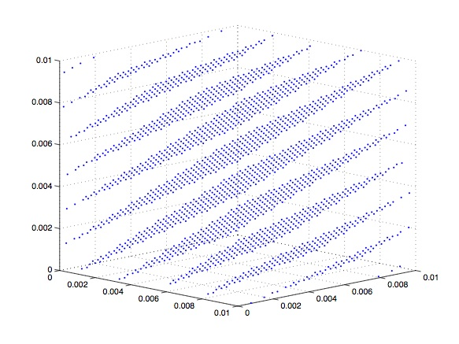
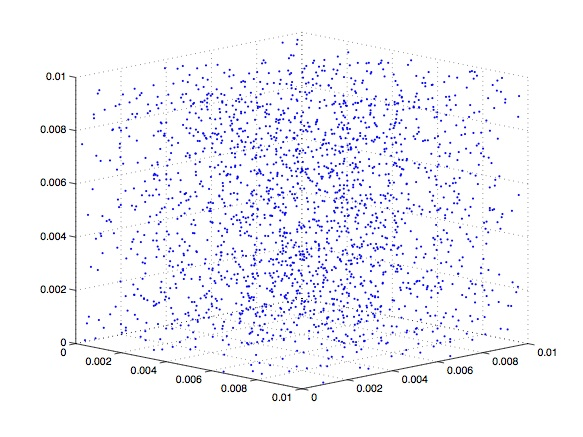

# Chapter 1: Simple Monte-Carlo

## C++ コーディングスタイル

以前から C++ Design Patterns and Derivatives Pricing （以降 MJ本）のコーディングスタイルが気になっていたので見直してみた。以下のサイトを参考にした。

- [Google C++ Style Guide](https://google.github.io/styleguide/cppguide.html): 言わずと知れたGoogleのスタイルガイド
- [C++言語の命名規則をいくつか調べる](https://qiita.com/asaoaz/items/a0ff86e4e9fa3819a1d1): 上記のサイトの良いサマリー
- [C++ コーディングスタイルメモ](https://qiita.com/shirakawa4756/items/55b509fb56cb1bb0c9a4): 色々まとまっている

Google C++ Style Guideをざっと眺めてみたが、自分が普段から使っているコーディングスタイルはおおよそ従っていた。

### 命名規則

ただし一つ驚いたのが変数名のスタイルだ。[Variable Names](https://google.github.io/styleguide/cppguide.html#Variable_Names)の項によると、変数にはスネークケースが推奨されている。なぜStyle Guideがこのように定めたのかは分からない。

> #### Variable Names
> The names of variables (including function parameters) and data members are `snake_case` (all lowercase, with underscores between words). Data members of classes (but not structs) additionally have trailing underscores. For instance: `a_local_variable`, `a_struct_data_member`, `a_class_data_member_`.

 しかし、自分がこれまで見てきた限り、変数名は常にキャメルケースだった。金融に限った話なのだろうか。個人的には毎回アンダースコア`_`を打つのは非常に面倒だ。また職場のスタイルと違うので、このプロジェクトではキャメルケースを使うことにする。

 なお、MJ本では変数名にキャメルケース、関数名にパスカルケースが使用されている。

 ### `const`をつけるかどうか

 私個人は`const`教の信者なのでとにかく`const`をつけたくて仕方なくなる。なぜ信者なのか改めて考えてみたら、仕事で始めて取り組んだC++のプロジェクトのことを思いだした。たぶんこのトラウマのせいだろう。2000年頃に書かれたコードで、一応C++が使われていたがコーディングスタイルはほとんどC言語だった。全ての変数は関数冒頭で定義され、数千行続く関数の中で使い回されていた。一番やばかったのが、ループ変数として使われていた`k`が途中で`0` or `1`のフラグとして利用されていたことだ。さすがにそれはないでしょう。。

 とにかく冒頭で宣言された変数が途中で使い回されるので全部脳内メモリに入れておく必要があった。さらに、ループ内の`if`文の`else`ブロックで初期化されていたりして、上からコードを読んでいって初めて変数に出会ったときには右辺に現れる、とかもざらにあった。また関数の引数を上書きして全く異なる意味を持つ変数として使っていたりもした。そんなこんなで可読性は最悪で、最初のC++のプロジェクトだったことも相まって非常に苦労したことを覚えている。
 
 一方、実際には値が途中で変わらない変数が多かった。したがって可読性を高めるために最初に行ったのは可能な場所全てに`const`をつけることだった。状態を追わなければならない変数が減り、可読性が一気に向上したことを覚えている。

### ループ内変数

例えば`SimpleMCMain1.cpp`で、MJ本はループ内で繰り返し使われる一時変数を外で定義している。

```cpp
    double movedSpot = spot * std::exp(rate * timeToExpiry + itoCorrection);
    double thisSpot; // only used as a temporary variable in the following loop
    double runningSum = 0;

    for (unsigned long i = 0; i < numberOfPaths; i++)
    {
        double thisGaussian = getOneGaussianByBoxMuller();
        thisSpot = movedSpot * std::exp(rootVariance * thisGaussian); // here
        double thisPayoff = thisSpot - strike;
        thisPayoff = thisPayoff > 0 ? thisPayoff : 0;
        runningSum += thisPayoff;
    }
```

一方でループ内で変数を宣言して初期化することもできる。

```cpp
    double movedSpot = spot * std::exp(rate * timeToExpiry + itoCorrection);
    double runningSum = 0;

    for (unsigned long i = 0; i < numberOfPaths; i++)
    {
        double thisGaussian = getOneGaussianByBoxMuller();
        double thisSpot = movedSpot * std::exp(rootVariance * thisGaussian); // here
        double thisPayoff = thisSpot - strike;
        thisPayoff = thisPayoff > 0 ? thisPayoff : 0;
        runningSum += thisPayoff;
    }
```

前者は昔のコンパイラやマシンでは効率的だったらしい。宣言が一度だけだから。しかし現在のマシン上では`double`の宣言は無視できるほど早いとされている。（要出典、むかしどこかで見た気がする。）更に現代のコンパイラは賢いので最適化してくれる可能性もある。また、ループ内で定義したほうがスコープが狭いので可読性が高い。`const`も付けることができて幸せな気持ちになれる。よってこのプロジェクトでは基本的に、ループ内の一時変数はループ内で宣言することにする。


## 乱数生成

### MJの実装と問題点

MJ本ではGaussian乱数生成に以下のアルゴリズムを用いている。

- C言語の`rand()`を用いて一様乱数（正しくは偽一様乱数乱数だが面倒なのでこれ以降は「偽」を省略）を生成
- Box-Muller法で標準正規乱数に変換

まず、C言語の`rand()`関数は使ってはいけない。私は厳密な実装を調べてはいないが、Stuck overflowの[この](https://stackoverflow.com/questions/1026327/what-common-algorithms-are-used-for-cs-rand)ページや[良い乱数・悪い乱数](http://isaku-wada.my.coocan.jp/rand/rand.html)によると、線形合同法（[Wikipedia](https://en.wikipedia.org/wiki/Linear_congruential_generator)）もしくはその拡張が使われているようだ。

線形合同法は軽量で、昔の環境では重宝されてようだが、特に多次元分布が周期性を持つことが知られている。ググってみたら良いページが見つかった。[C言語による乱数生成 - 2.1.4. 乱数の質の比較〜特に線形合同法の欠点について](https://omitakahiro.github.io/random/random_variables_generation.html#Comparison)。例えば、$3N$個の乱数 $\{x_i\}_{i=1,\cdots,3N}$ を発生させ、$N$個の３次元ベクトル $\left(x_{i}, x_{i+1}, x_{i+2}\right)$ を作る。これをプロットしたのが１つ目の図だ。明らかに周期性があり、離散的な"平面"上に点が分布していることがわかる。なお、２つ目の図はメルセンヌ・ツイスタによるものであり、少なくとも目視する限りは一様に分布しているように見える。

 
C言語による乱数生成 - 2.1.4. 乱数の質の比較〜特に線形合同法の欠点について (https://omitakahiro.github.io/random/random_variables_generation.html#Comparison) より引用

ところで線形合同法のもう一つの問題点は周期の短さとされており、最大で$2^{32}$（？）のようだ。もし実用上の周期が $2^{32}$ であればデリバティブ評価の実務上では大きな問題にはならない。

### C++の機能

